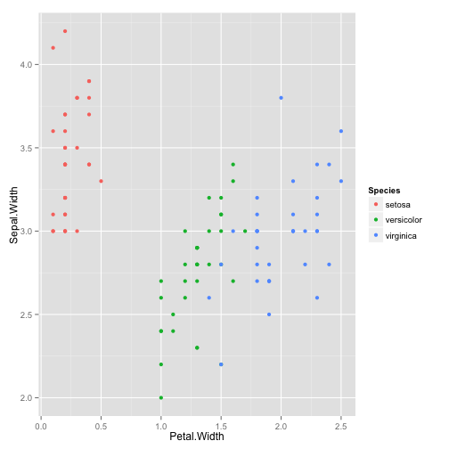
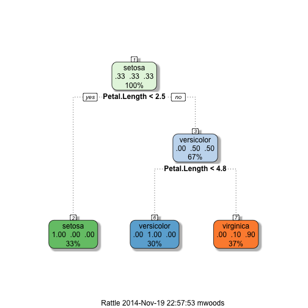

```r
data(iris)
library(ggplot2)
library(caret)
inTrain <- createDataPartition(y=iris$Species, p = 0.7, list = F)
training <- iris[inTrain,]
test <- iris[-inTrain,]
dim(training); dim(test)
```

```
## [1] 105   5
```

```
## [1] 45  5
```

You can also embed plots, for example:


```r
qplot(Petal.Width, Sepal.Width, colour = Species, data = training)
```

 


```r
mod <- train(Species~., method="rpart", data=training)
plot(mod$finalModel, uniform = T, main = "Classification Tree")
text(mod$finalModel, use.n = T, all = T, cex= .8)
```

 


```r
library(rattle)
fancyRpartPlot(mod$finalModel)
```

 


```r
predict(mod, test)
```

```
##  [1] setosa     setosa     setosa     setosa     setosa     setosa    
##  [7] setosa     setosa     setosa     setosa     setosa     setosa    
## [13] setosa     setosa     setosa     versicolor versicolor versicolor
## [19] versicolor versicolor virginica  virginica  versicolor versicolor
## [25] versicolor versicolor versicolor versicolor versicolor versicolor
## [31] versicolor virginica  virginica  virginica  virginica  virginica 
## [37] virginica  virginica  virginica  virginica  virginica  virginica 
## [43] virginica  virginica  virginica 
## Levels: setosa versicolor virginica
```
